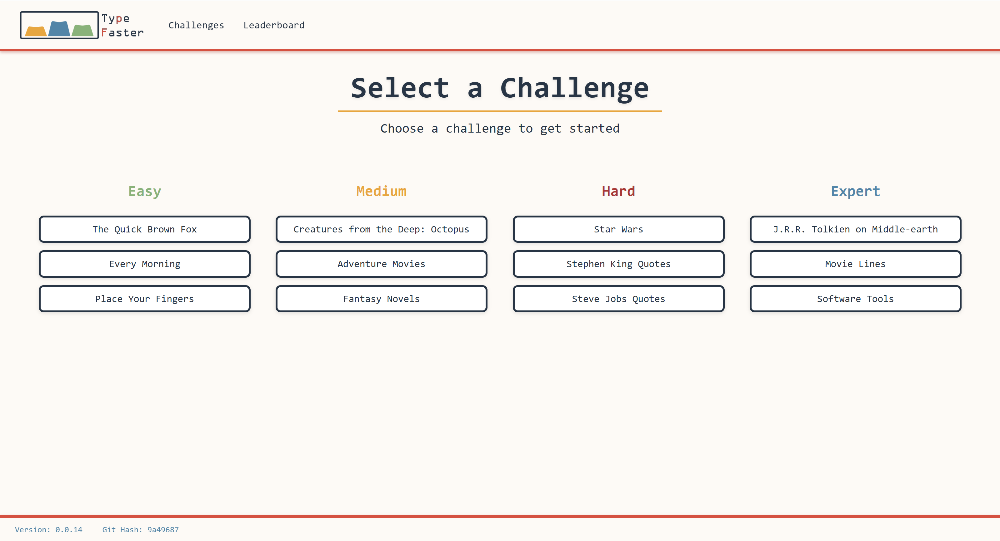
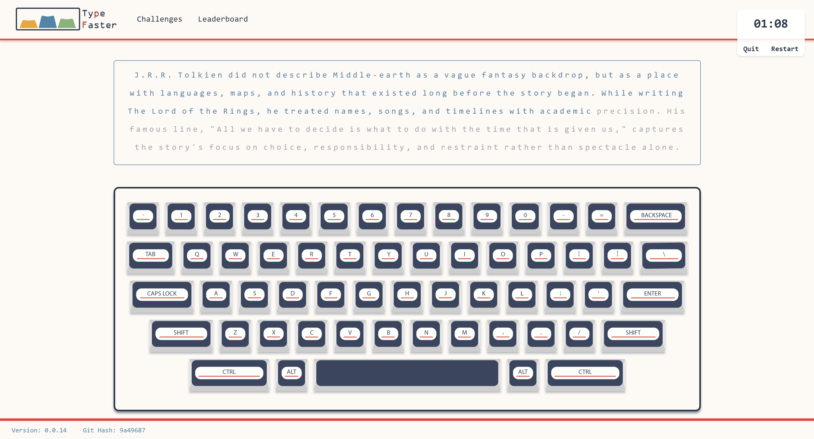
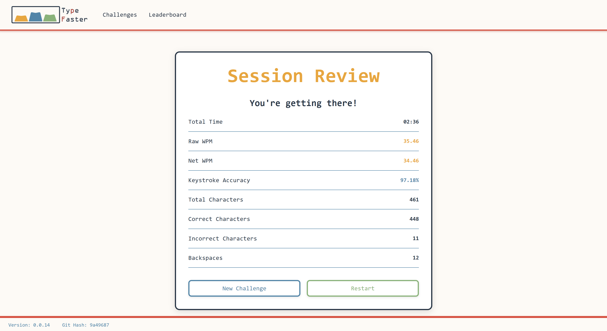

  

# Type Faster

A typing test web application designed to evaluate and improve typing speed, accuracy, and confidence through a curated set of progressively challenging exercises.

## Overview

**Type Faster** offers a structured typing practice experience that adapts difficulty through increasingly complex challenges. The application emphasizes real-time feedback, correctness under pressure, and detailed performance analysis after each session.

Users select from challenges ranging from *easy* to *expert*, with each level introducing longer passages, more complex vocabulary, and broader punctuation requirements. By the highest difficulty tiers, challenges are designed to push both speed and precision simultaneously.

## Core Features

### Challenge Selection

- Multiple difficulty tiers: **Easy → Expert**
- Difficulty increases through:
  - Longer challenge passages
  - More complex word choices
  - Expanded punctuation and formatting requirements
- Designed to progressively build typing confidence and consistency

### Typing Challenge Experience

- Real-time keystroke evaluation and visual feedback
- Correct characters advance the cursor forward
- Incorrect characters are highlighted in red and must be corrected before progress can continue
- All major modifier keys (Shift, Caps Lock, etc.) are correctly interpreted and applied
- Challenges only conclude when:
  - All characters are entered correctly in order, **or**
  - The user chooses to restart or quit the challenge

This strict input model reinforces accuracy and deliberate correction over brute-force typing.

### Typing Review & Metrics

After completing a challenge, users are presented with a detailed performance summary and general assessment.

**Metrics include:**

- **Total Time**  
  Time (in minutes) from the first keystroke to the final correct character.

- **Raw WPM**  
  Total characters typed (including incorrect) ÷ 5.

- **Net WPM**  
  Correct characters typed ÷ 5.

- **Keystroke Accuracy**  
  Percentage of correct characters relative to total submitted characters.

- **Total Characters**  
  Total number of characters submitted, including incorrect entries.

- **Total Correct Characters**  
  Characters entered correctly, accounting for:
  - Proper casing
  - Correct punctuation
  - Correct position within the challenge string

- **Backspaces**  
  Total number of backspace key presses during the challenge.

After reviewing results, users may restart the current challenge or select a new one.

  
  
  

## Design Notes

- Input validation is intentionally strict: incorrect characters must be resolved before progress continues. This design prioritizes accuracy and correction habits over raw speed.
- Modifier key handling is explicit, ensuring characters are only accepted when entered with the correct casing and punctuation.
- Typing metrics are derived directly from the full keystroke history, allowing raw and net WPM calculations to reflect both speed and error patterns.
- State is centralized to maintain consistency across challenge flow, review screens, and navigation events.

## Technical Details

- **Framework:** React (Vite)
- **Language:** TypeScript (5.9.3)
- **Routing:** React Router
- **State Management:** React Redux
- **Build Tool:** Vite 7.2.4
- **Runtime:** Node 24.11.1

The application relies on centralized state management to track challenge progress, keystroke history, modifier key state, and post-challenge metrics across routes.

## Future Improvements

A planned **Version 2** extends this project beyond a standalone frontend by integrating with a backend service that:

- Supplies typing challenge content via an API
- Records user session metrics for persistence and analysis
- Exposes a leaderboard API to compare a user’s best performance against other users

This evolution introduces a client–server architecture and enables competitive and historical performance tracking.

## Asset Credit

All visual assets used in this project were created by me.
